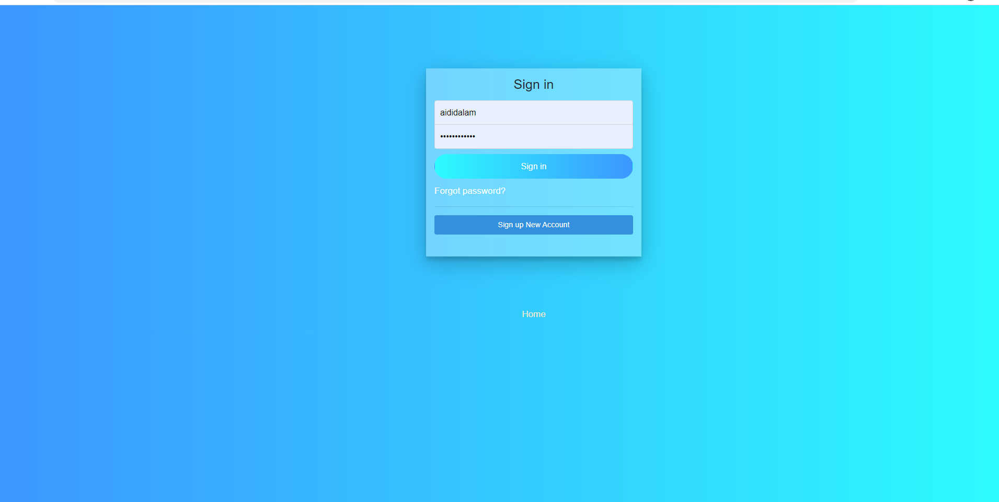
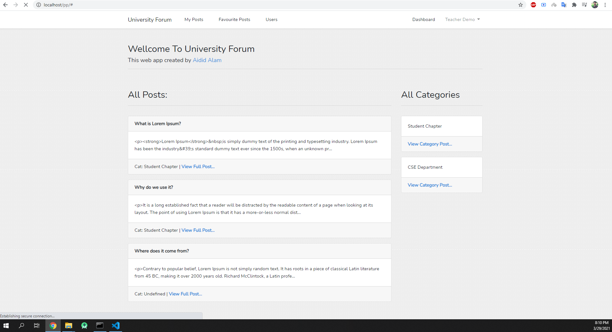
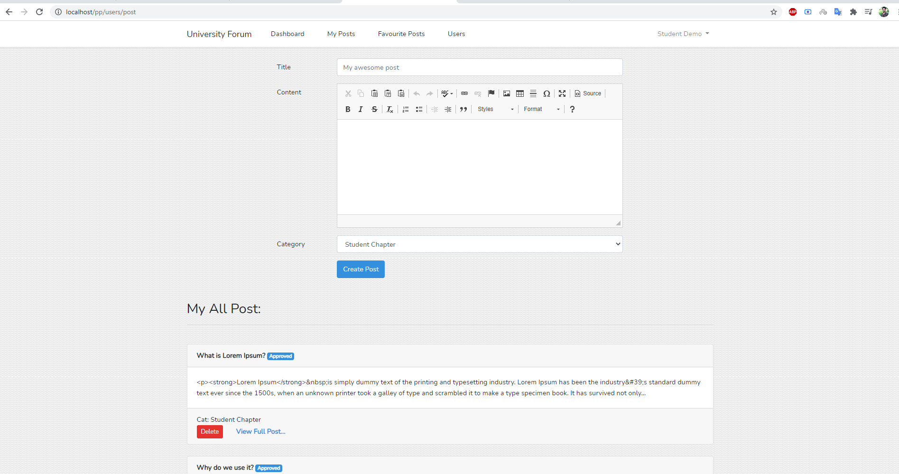
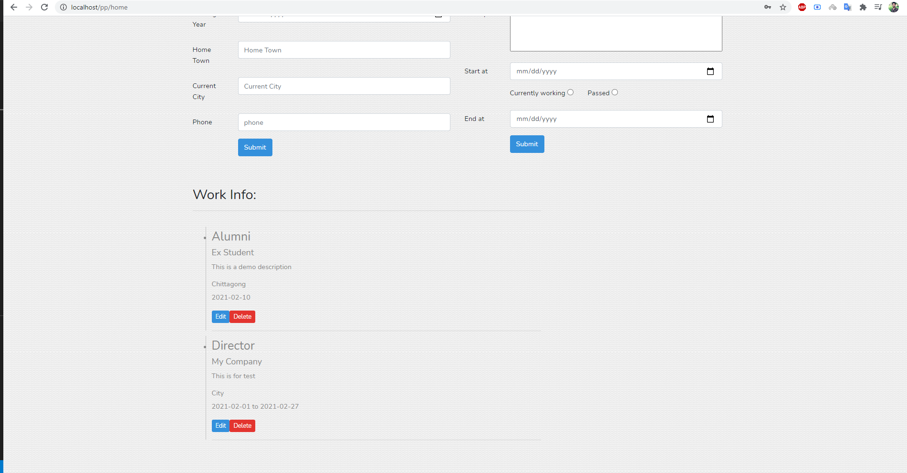
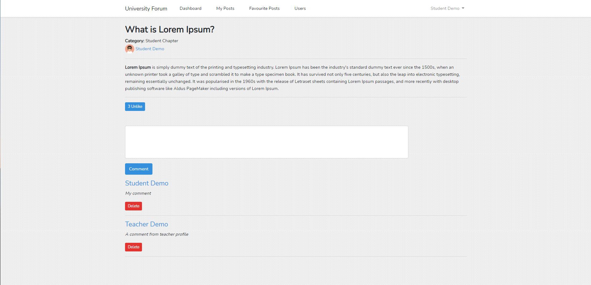
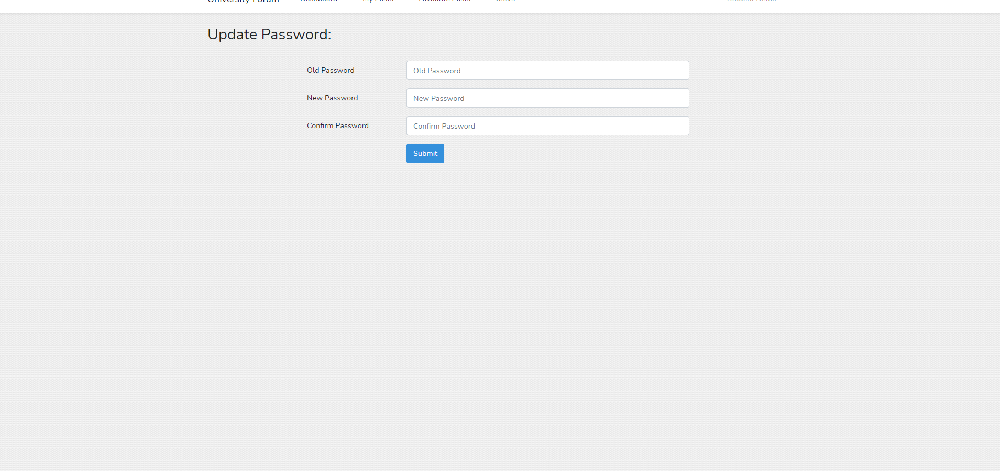
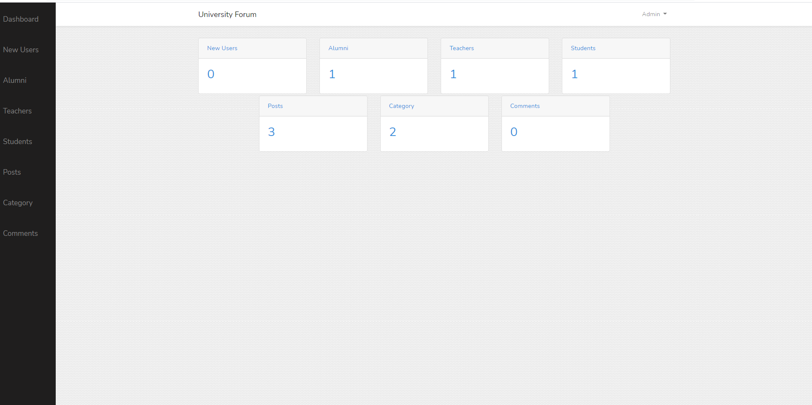
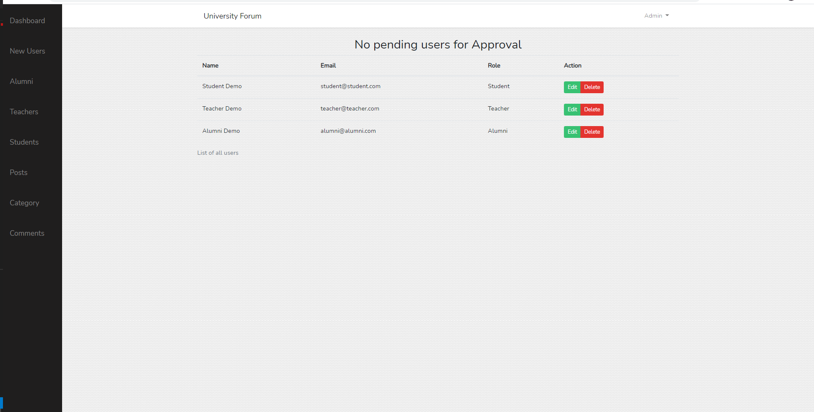
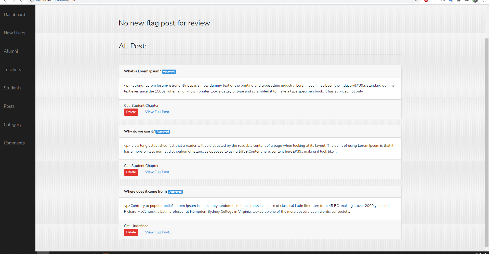
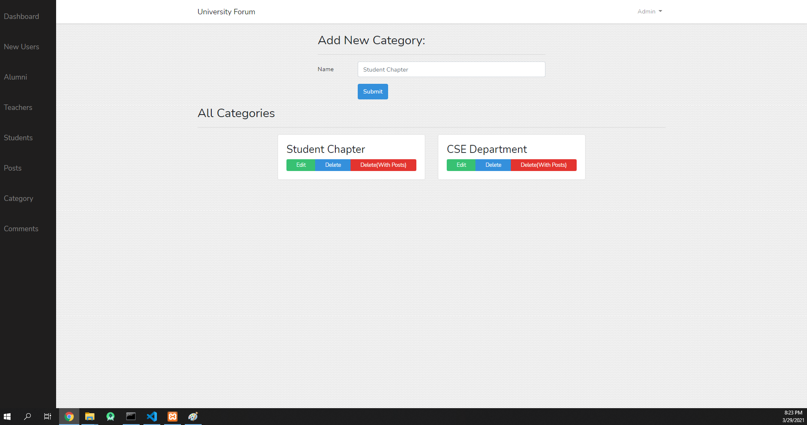

# University Forum Web Application

A forum where students,teacher,alumni can be connected with each other. 
Students, teacher, alumni can post abount diffrent things and anyone logged in can comment or like the post.

# Features:

- Anyone can register but admin choose who can complete their registration
- Anyone can post but admin approve the post before goes it to public
- Alumni can update their current job position
- A timeline for alumni's job experience
- User can update their profile like Hometown, Current Place etc
- User can reset their password from their account
- User can like and unlike other's post
- User can comment on other's post
- An admin panel for take care of new registered users, new posts.
- Auto filter bad words in posts and comments.

# Here are some screenshots:
Login Screen: 

Home Page:

New Post Page:

Alumni Timeline:

Full Post:

Passeword Changing Feature

Admin Dashboard

Admin can add/delete/edit users

Admin can review posts

Admin can add new category

# Demo:
https://demo.aididalam.dev/university-forum

**Admin**
email: admin@admin.com
password: 12345678

**Teacher**
email: teacher@teacher.com
password: 12345678

**Student**
email: student@student.com
password: 12345678

**Alumni**
email: alumni@alumni.com
password: 12345678

# How to install
1. Edit .env file and update database details
Then run this on terminal:
`php artisan migrate`
